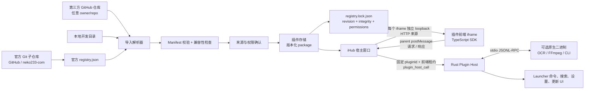

# iHub 插件架构与分发模型

## 目标

iHub 的插件系统要同时满足两类需求：轻量的 TypeScript 前端扩展，以及 OCR、翻译、FFmpeg、索引器、系统自动化等需要原生二进制的专业扩展。系统以 Git 仓库为一等来源，不强制经过单一插件中心；官方 registry 只是一个经过维护的目录。

v1 的核心不变量：

- 每个插件包根目录都有一个经过 schema 校验的 canonical `plugin.json`；`ihub.plugin.json` 只作为既有包的导入兼容别名。
- 前端的受支持调用面是版本化的 SDK/IPC 合同；插件不应依赖宿主私有代码。
- 每一次已安装版本都有来源、固定 revision、内容哈希、权限快照和安装时间的 lock 记录。
- 插件可以含原生二进制，因此安装信任模型必须诚实地假设“插件就是本机代码”。

## 组件关系

## 包、注册表与锁

### 插件包

包是独立 Git 仓库或本地目录。包内 canonical `plugin.json` 是作者的声明；导入器也接受旧包使用的 `ihub.plugin.json` 兼容文件名，但生成器、SDK 文档与新发布都以 `plugin.json` 为准。构建后 `dist/` 和可选 `bin/` 是可执行内容。包本身不应依赖主仓的 node_modules，也不应通过相对路径读取主应用的源码。

### 公开 uTools manifest 兼容层

`plugin.json.tools` 的名称、描述、输入与可选输出 JSON Schema 会成为宿主锁定的 Agent catalog。当前 lifecycle owner 只有在初始化阶段通过 `utools.registerTool` 注册与清单精确同名的 handler 后才可调用；请求绑定 plugin、tool、UUID、lease 与 host window，输入/输出由 Rust 再按清单 schema 校验，进度独立回传，取消、十分钟超时、页面退出、停用、更新和卸载都会清理等待方。tools-only 包可以只声明 `preload + tools`，由宿主生成不可见空页面。

导入器也识别公开 uTools `plugin.json` 的受限 UI 子集：`main`、`logo` 和带文本 `cmds` 的 `features`。每个 feature 会投影为一个 iHub 前端命令；宿主在被激活时以原 feature `code` 调用 iframe 中固定注入的 `window.utools.onPluginEnter` 回调。`onPluginReady`、带布尔退出原因的 `onPluginOut`、分离窗口就绪后的单次 `onPluginDetach`、同步 `dbStorage`、原生 `copyText`、`screenColorPick`、`showNotification(body, clickFeatureCode?)` 与 `shellOpenExternal(url)` 同样可用。`copyText` 不再依赖 iframe 浏览器剪贴板权限；最多 48 KiB UTF-8 文本经活动租约交给 Rust 的串行重试剪贴板通道。外链只接受最长 2048 字符、无控制字符的绝对 `http/https` URL 或非空 `mailto` 收件人；使用隐藏后台进程参数直接交给系统，不开放文件路径、任意协议或 shell 字符串。分离事件只能由可信 React host 在活动 Bridge ready 后投递；隐藏 runtime 不会伪造窗口类型，晚注册的回调仍会收到这一轮分离通知。通知由原生系统通道显示，并以 `iHub · <plugin-id>` 固定标出来源；内容最多 1000 字符，每插件每 10 秒最多 5 条，重载 runtime 不重置限流。Windows 可选 `clickFeatureCode` 只接受插件当前声明的静态或动态功能码，并在通知点击时重新校验后通过可信启动器事件激活；未验证平台明确拒绝。`readCurrentFolderPath/readCurrentBrowserUrl` 只投影启动器显示前捕获的一个外部前台 HWND/PID，逐次确认后重新验证，不枚举任意窗口、不模拟按键且不读剪贴板；Windows Explorer 本地文件夹通过 Shell COM 读取，受支持浏览器网址只从非密码 UI Automation 地址编辑框读取。宿主绘制的子输入框支持 set/value/remove/focus/blur/select；可见主 surface 还可请求 hide/show/out 窗口路径，以及官方拼写的 `setExpendHeight(height)`。高度只接受 100–900 的整数内容像素，可信标题栏另占 60 像素；切换插件时恢复默认高度，隐藏 runtime 和分离窗口不会取得主窗口缩放能力。每个窗口请求都先由 Rust 核对该包确为 uTools 导入包和当前活动租约。`dbStorage` 在 ready 回调前从宿主恢复 JSON 快照，页面内同步读写缓存，再通过活动 iframe lease 异步原子持久化到当前插件的独立命名空间；它不能读取普通设置或其他插件数据，并继续受每插件 128 项、48 UTF-8 字节键和 64 KiB 单值上限约束。取色始终走可见 iHub 宿主的逐次确认、固定延迟和单像素 HEX/RGB 投影，不能取得截图、坐标或持续采样句柄。

这仍不是 Electron 兼容层：声明的 uTools `preload` 会纳入快照哈希，并从保留的内存路由在固定兼容脚本之后执行，但它只是 CSP 与 iframe 沙箱内的普通脚本。宿主仅提供 `utools/rubick`、最小 CommonJS `module/exports`，以及只含受限 `contextBridge/ipcRenderer` 的 `require("electron")`；其他 `require`（包括 `fs`、`child_process`、网络与原生扩展）明确抛错，原 preload 包路径也继续被 loopback 静态资源解析器拒绝。tools-only 包除两段内存脚本外不暴露包目录；普通 uTools UI 包仍只服务其入口资源根，不会因此接入 iHub 本地搜索索引或 launcher context。原生 iHub 插件继续使用下面的专用 `dist/` 资源根约束。

`utools.ai` 也不把 Provider 凭据或任意网络能力交给 iframe。用户在第一方偏好设置中配置 OpenAI-compatible `/v1` 端点、模型和默认项；Rust 从系统凭据保护的加密存储读取 API key，执行禁重定向且有大小/时限的 Chat Completions 请求，再把有界文本、推理增量或同一 surface 的函数调用事件投影给兼容脚本。模型 ID 带 provider scope，原始 ID 只有在多个 Provider 间唯一时才可直接解析。请求注册表同时绑定插件 ID、活动 lease 与取消句柄；surface 释放会中止请求并拒绝尚未完成的函数回调。BrowserWindow 不取得该通路。

uTools 同步文件对话框不经过异步 iframe Bridge：兼容脚本只向本插件随机 origin 下的固定 POST 路由发送同步 XHR，服务器重新确认该 lease 仍是当前可见 surface、保留一个宿主原生操作槽，再调用 setup 时安装的可信 UI-thread dispatcher。请求具有专用 capability header、same-origin/Host/Origin 检查、32 KiB JSON 上限与严格选项白名单；返回值也重新检查为有界路径数组、单一路径或取消值。dispatcher 仍会复核插件启用状态与 uTools 来源，并只把系统选择器中由用户明确选定的路径投影回该插件。

跨插件 `redirect` 不允许 iframe 指定目标 plugin ID 或 command ID。源只提交官方 label 与有界 typed payload；Rust 根据当前已验证插件清单解析候选，并把候选 ID、展示名和规范化 action 作为可信桌面事件交给主窗口。React 会再次对照当前启用插件与命令；唯一候选直接创建目标 command event，歧义候选由启动器选择，其他选择或 surface 隐藏会清除 payload。目标 uTools bootstrap 最后再次验证 action 形状，才以 `from: "redirect"` 触发 `onPluginEnter`。

### `plugins/registry.json`

官方 registry 是可提交、可审计的目录，不是私有服务数据库。每个条目至少描述：插件 ID、显示信息、Git URL、默认 ref、清单路径、支持平台与更新通道。iHub 可以读取此文件发现官方插件，也可以读取任意符合相同格式的 registry URL/文件。

第三方 GitHub 导入不需要先登记到官方 registry：导入器直接读取目标仓库。在 UI 中它应显示为“社区来源”，并记录原始 Git URL 与 owner；不能借由同名 ID 覆盖已经受信任的官方来源。

### `plugins/registry.lock.json`

lock 文件是解析结果，不是仅有版本号的缓存。每项固定：

- canonical Git URL、请求的 ref 与不可变 commit；
- canonical 清单、完整可服务前端目录、声明图标，以及每个平台原生二进制的 SHA-256；
- 安装时批准的权限快照、API 版本和目标平台；
- 发布/解析时间与更新通道。

当前实现**不会**在界面中渲染逐字段的权限或哈希 diff，也不会把候选代码静默覆盖到已安装版本。用户点击“应用更新”后，宿主才重新解析已保存的 ref、暂存并校验候选快照；若候选的任一声明权限（包括网络目标、全局快捷键与 native API）或原生二进制声明与已安装版本不同，例行更新会在替换前拒绝。当前版本要求用户先卸载受管快照、审阅候选后再通过导入信任提示重新导入；普通代码或资源哈希变化仍需要用户确认后才会原子替换，且不会自动启动候选代码。自动部分只是**插件中心打开时**的一次只读发现，以及中心保持打开期间每 30 分钟一次：它仅检查**已启用、带 immutable source lock、`stable`、`autoUpdate: true` 且来源精确匹配官方 `https://github.com/neko233-com/<repo>.git`** 的插件。每轮最多尝试 24 个、每个远端最多 4 秒、总网络预算 12 秒；若有安装/更新正在进行或另一轮自动检查尚未结束，本轮会跳过而不是排队。检查只解析 Git ref，不检出代码、不改 lock、不启动插件；它不是应用全局后台任务。二进制插件从不后台升级。

## 前端与宿主

已安装或显式链接的 iHub 原生插件，其 `entry.frontend` 会先被解析为包内 canonical 文件；入口必须位于清单所在目录下的专用构建子目录（通常是 `dist/`），宿主仅将该入口所在目录作为只读资源根。这样清单、源码、`.env`、Git 元数据与 `bin/` 不会被 iframe 同源读取。公开 uTools 兼容包允许其文档规定的同级 HTML 静态资源根；manifest 声明的 preload 原路径仍不可请求，但经过大小、包内路径与快照哈希验证的内容可从宿主保留内存路由加载。每个 iframe 绑定随机 `127.0.0.1` 端口和随机路径令牌；服务只接受 `GET` / `HEAD`，拒绝路径穿越、符号链接逃逸、目录列举和跨目录访问，并以 `no-store`、`no-referrer`、`nosniff` 与最小 CSP 返回资源。iframe 还带 `sandbox="allow-scripts allow-same-origin"` 和 `no-referrer`，不开放 top navigation、popup、download、form 或 modal。Tauri `asset:` 协议已不用于插件前端，本地开发链接也不会扩大 Tauri 的 asset scope；loopback iframe 不匹配任何本地或 remote Tauri capability，不能把自身当作 Tauri IPC 调用方。

网络声明目前是明确的粗粒度执行门。没有非空 `permissions.network.allow` 时，CSP 的 `connect-src` 只有 `'self'`，`img-src` / `media-src` 只有本地、`data:` / `blob:`，因此外部 connect、image 和 media 都被阻断；存在任意非空声明时，CSP 才开放 `connect-src https: wss:` 以及 HTTPS image/media。`network.allow` 中的 destination 会进入安装告知、source/integrity lock 和例行更新的安全比较，但当前 CSP 尚未按每个声明 destination 生成逐 origin 白名单；不能把它描述成完整的 egress 防火墙。原生 worker 也不受这条 iframe CSP 约束。

跨 origin iframe 的 display-capture / microphone Permissions Policy 也由原生租约决定，而不是由 renderer 自报。只有 Rust 已验证插件仍启用、清单分别声明 `screenCapture: true` / `microphone: true`、租约 purpose 为可见 `Surface` 且该 lease 仍活动时，可信 React host 才按原生 lease 为对应 iframe 分别委派 `display-capture` / `microphone`；隐藏搜索 `Runtime`、未声明权限、过期租约和浏览器安全预览都不带该委派。两项权限彼此独立，只让可见跨 origin iframe 有资格在真实用户手势里调用相应浏览器 API，不会绕过浏览器／系统选择器、macOS Screen Recording 或麦克风等 OS 权限，也不会授予原生捕获 API。浏览器 QA 可以检查 host 文案和属性条件，却不能证明系统权限提示、窗口／屏幕选择或实际帧／音频采集在桌面端成功。

默认生产桥是 parent-frame `postMessage`：`@ihub/plugin-sdk` 在 iframe 内把 `{ pluginId, method, params }` 作为关联 ID 的请求发送给父窗口，父窗口同时验证当前 iframe 的 `contentWindow` **和它的精确 loopback `origin`**，忽略请求中自报的插件 ID，并以当前已打开插件的 ID 和**宿主签发的前端租约**重建请求。随后父窗口调用 Rust 的 `plugin_host_call({ request })`，再将结果或错误以该精确 origin 回传 iframe。租约在更新、停用、重新链接、解除链接或卸载时失效；Rust 侧会在同一状态转换锁内再次校验，因此已加载的旧文档不能继续借 Bridge 调用新版本的能力。它为 TypeScript 前端建立了直接 Tauri IPC 之外的窄 Bridge；原生 worker 仍不是沙箱，必须只从可信发布者导入。

### 插件分离窗口

可见插件标题栏提供“分离窗口”，宿主表面处于激活状态时也可按 `Ctrl+D`。这个动作不会把插件页面升级成原生权限主体：Rust 只接受由 `main` 窗口提交、满足同一严格 ID 语法且当前已启用并通过前端入口完整性校验的插件 ID；窗口标签由该 ID 的 SHA-256 派生，URL 固定为 iHub 自己的 `index.html?ihubDetachedPlugin=<id>`，IPC 没有 label、scheme、host、path 或任意 URL 参数。窗口为原生、可调整大小的 800×600 普通窗口，但其中加载的仍是同源 iHub React host；真实插件继续位于该 host 内的独立 loopback iframe，并复用完全相同的 `PluginFrontendFrame`、精确 origin 验证和 Bridge。

只有 iHub 自己的可信 React host 匹配 `plugin-detached-*` 本地 capability。它获得的 custom-command ACL 精确只有 7 条：`get_detached_plugin_window_bootstrap`、`close_detached_plugin_window`、`get_plugin_frontend_url`、`issue_plugin_cursor_color_approval`、`release_plugin_frontend_url`、`touch_plugin_frontend_lease`、`plugin_host_call`，外加 Tauri event 的 listen/unlisten；没有 updater、窗口创建、shell、文件系统、进程、Node/Electron 或 remote URL capability。该 host 内的 loopback iframe 仍没有 Tauri capability，只能走经过边界校验的父窗口 Bridge。

原生注册表维护精确的 `pluginId → window label + active lease` 绑定；分离窗口不能为其他插件取入口、触碰或释放其他窗口的 lease，`plugin_host_call` 与一次取色确认也重复检查调用窗口。主窗口发起的普通前端命令和搜索查询会在原生层解析 owner，并只用 `emit_to` 投递到该 label；前端命令的全局快捷键同样只投递给分离 owner，keyword 与原生 worker 快捷键则只回到可信主窗口，不广播给所有 WebView。搜索 provider 的 readiness 由原生快照及变更事件同步给主窗口；一次查询响应最多在原生端保留 60 秒、总计最多 64 份 issued snapshot，选择时必须同时命中原始 plugin/provider/request/result ID，并在同一锁内消费一次，launcher renderer 不能自报任意 selection payload 重放。每个插件仍只有一个当前 runtime；分离期间主启动器和隐藏搜索 runtime 不会替换它。正常关闭、平台直接销毁和 React 卸载都走幂等清理，原生窗口事件会主动释放 loopback lease，因此 renderer 来不及执行异步 cleanup 时也不会留下活动表面。

浏览器 QA 可显式打开 `?ihubDetachedPlugin=browser.preview&ihubDetachedPreview=1`。该路由只画可信 host chrome 和安全状态，明确不创建原生窗口、不签发 loopback lease、不挂载 iframe，也不授予 Tauri/Node/shell；重复字段、未知参数、路径、URL、fragment 注入和桌面端伪装 preview 都失败关闭到宿主错误页。

启动器上下文交接使用这条桥的反向、一次性路径：可信父界面先以专用确认面板列出已启用、已安装、带 frontend 入口且声明精确 `launcherContext.*` 类别的命令；候选渲染和筛选本身不会创建记录。只有用户再次确认一个命令后，主界面才等待该 iframe 的 `lifecycle.ready`、命令注册及原生命令事件订阅完成，并用该**精确前端租约**调用 `issue_plugin_launcher_context` 暂存最多 60 秒的受限数据，再以同一租约把**不含内容**的 `contextId` 附到该命令事件。iframe 必须持有有效前端租约并主动调用 `launcherContext.consume` 才能取走一次。记录按插件、命令、租约和分派请求绑定，过期、重复、生命周期切换或跨插件/命令/租约使用都会失败；父界面还用确认 generation 和源码身份保护每个异步阶段，隐藏、关闭、焦点重开、来源更新或租约替换都会先作废 generation。父界面会把成功分派但尚未消费的 token 以精确 generation/租约保留为可撤销句柄，直到消费、TTL 或表面释放；因此任何取消边界都能同时撤销未发射和已发射未消费记录。文本受大小限制；文件只给规范化 metadata 和不透明 handle，不给 path 或读取权；图片只给 PNG metadata/handle，不给 pixels。该能力不是 ambient clipboard/filesystem 权限，也不会给原生 worker 自动追加路径或内容。

`window.__IHUB_PLUGIN_API__` 是 SDK 为未来受控宿主表面保留的可选注入桥；当前 launcher 没有注入它。SDK 不提供直接调用 Tauri 的后备路径：浏览器预览必须显式传入 `createDevelopmentBridge()` 或自己的测试桥。

命令、搜索和一般事件的回调始终留在前端 JavaScript 中，不跨 IPC 序列化函数。若宿主要向插件分派事件，应通过相同的父窗口到 iframe `postMessage` 通道发送带 `ihub://plugin/<id>/…` 名称的事件，而不是让插件直接订阅 Tauri 事件。

### 当前生命周期行为

启用状态保存在 iHub 托管目录的 `.ihub-plugin-lifecycle.json`，而不写入 Git checkout 或本地开发项目。缺少记录的既有插件默认启用；停用或重新启用会跨重启保留。停用后宿主会清除该插件已注册的 iframe 命令与搜索提供器，并拒绝新的前端入口、桥接调用、原生命令和搜索查询。主界面也会卸载正在显示或后台懒加载的该插件 iframe。

“卸载”只接受 canonical 路径仍位于 iHub 托管目录、且带有宿主写入 Git 来源记录的快照；目标先在同一目录中原子移入隐藏 staging 名称，再删除并清理生命周期记录。本地开发链接显示为“解除链接”，只移除 `.ihub-local-links.json` 中的记录，**永远不删除开发项目目录**。若同一 ID 正在被本地链接覆盖，必须先解除链接，才能对受管快照执行卸载。

每个插件同时最多保留一条有效的 loopback 前端租约：隐藏搜索 runtime 与可见表面切换时会签发新租约，并撤销旧文档，避免迟到的 `dispose` 清理新 runtime 的注册。租约会在 iframe 关闭、插件停用、更新、重新链接、解除链接或卸载时撤销；主 renderer 每 30 秒发送心跳，native 端会回收 5 分钟未续约的异常残留监听器。同 ID 的 Git 更新或本地链接切换会使前端重新请求新租约，而不是继续使用旧入口。这个资源边界不改变原生 worker 的信任模型，用户仍应只链接和运行可信项目。

当前原生命令是单次启动任务：未声明 `contributes.commands[].run.timeoutMs` 时上限为 60 秒，显式原生命令可将一次前台等待提高到 1,000 ms–30 分钟。该 run 策略会进入来源锁与例行更新的安全比较，不能由普通更新悄悄放宽。到期时宿主只终止声明的 worker；若它自行启动 FFmpeg 等子进程，当前版本不承诺递归清理。停用会阻止**新的** worker 启动，但不会强制终止已经在执行的进程。完整的进程级停用/取消、后台继续、进度与产物管理需要后续把子进程句柄纳入长期运行时注册表。

宿主负责：

- 在激活前校验 `engines`、入口文件、平台二进制与 lock 完整性；
- 根据清单和用户授权执行桥接层能力检查；
- 对命令/搜索设定超时、并发和结果大小限制，防止单个插件阻塞 launcher；
- 为每个插件提供独立数据目录、日志标签、崩溃隔离与禁用／移除入口；锁定版本回滚尚未实现；
- 在自动启动恢复时只激活声明 `onStartup` 且用户允许的插件。

插件负责：

- 快速返回搜索结果、缓存可重用索引、取消已经无效的工作；
- 将设置置于自己的键空间，不读取其他插件的私有数据；
- 正确处理宿主重启、iframe 重载、取消和重复激活；
- 不依赖未记录的宿主内部命令或 Tauri API。

## 原生后端

原生后端通过 stdio 使用 `jsonl-rpc-v1`。这使 Rust、Go、C++、Python 打包程序与现有工具都能接入，并避免将平台 IPC 细节暴露给插件作者。

宿主根据 target 选择一个 `backend.binaries[]` 条目，使用受控环境变量启动，并严格验证 stdout 的一条 JSON-RPC 响应与请求 ID。stderr 被收集到该插件的诊断日志。当前实现是一请求一进程，不提供 `backend.restart` 的常驻或自动重启语义；插件必须将大文件通过经用户授权的路径或自身数据目录传递，不能把 GB 级图像或视频编码进 JSON。`run.timeoutMs` 只表达前台 worker 的最大等待时间，不是取消、常驻会话或后台 job 协议。

对于 FFmpeg 等被原生 worker 再启动的工具，清单中的 `process` 字段目前只可作为审计元数据；iHub 尚未提供浏览器前端可调用的 `process.spawn` Bridge API。该声明不构成针对原生后端的硬沙箱，真正可执行入口仍应是经清单锁定的 worker。

## 安全模型：明确的非沙箱设计

iHub 不把原生插件伪装成安全的脚本扩展。只要一个插件可执行本机二进制，它即可在用户权限范围内绕开前端 iframe 与 SDK，直接访问文件、网络和系统 API。因此：

1. `permissions` 是安装告知和桥接层门禁；当前例行 Git 更新会在替换前比较其语义权限集和原生二进制声明，并在变化时拒绝。它尚未提供 UI 中逐字段的权限／哈希 diff，也不是原生代码的隔离边界。
2. 当前可追溯来源链由 canonical Git URL、owner、请求 ref、实际解析 commit 和加载前复核的 source/integrity lock 构成；它没有发布者签名语义。
3. 权限或原生二进制声明变化、来源迁移和 owner 变化会阻断例行更新并要求重新审阅；发布者签名验证仍是未来能力。
4. 用户当前能禁用、解除链接或移除受管快照；锁定旧版本回滚、最近权限使用界面和字段级 diff UI 尚未实现。
5. 官方插件当前依赖代码审阅、不可变 commit/tag 与 registry lock；发布者签名、可验证构建证明和 SBOM 是后续正式分发目标。社区插件必须清楚标识为第三方。

该取舍换来了真正的桌面扩展能力，同时把风险信息放在用户做出安装决定之前，而不是事后隐藏在技术术语中。

## 官方插件仓库

主仓保留官方目录和 registry，插件本体以独立 Git 仓库维护，规范 URL 为：

| ID | 仓库 |
| --- | --- |
| `ihub-plugin-ocr` | `https://github.com/neko233-com/ihub-plugin-ocr` |
| `ihub-plugin-translate` | `https://github.com/neko233-com/ihub-plugin-translate` |
| `ihub-plugin-colorpick` | `https://github.com/neko233-com/ihub-plugin-colorpick` |
| `ihub-plugin-clipboard` | `https://github.com/neko233-com/ihub-plugin-clipboard` |
| `ihub-plugin-screenshot` | `https://github.com/neko233-com/ihub-plugin-screenshot` |
| `ihub-plugin-image-tools` | `https://github.com/neko233-com/ihub-plugin-image-tools` |
| `ihub-plugin-json-tools` | `https://github.com/neko233-com/ihub-plugin-json-tools` |
| `ihub-plugin-base-converter` | `https://github.com/neko233-com/ihub-plugin-base-converter` |
| `ihub-plugin-quick-note` | `https://github.com/neko233-com/ihub-plugin-quick-note` |

`plugins/official/` 只保存与这些子仓一一对应的 checkout/mapping 位置，方便主仓采用 Git submodule 或 CI checkout；发布内容仍以上述独立仓库的不可变 commit 为准。这样官方目录和第三方 GitHub 导入共用同一个解析、验证和更新路径。
