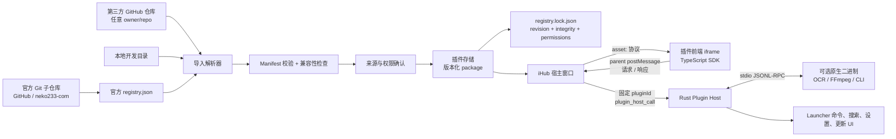

# iHub 插件架构与分发模型

## 目标

iHub 的插件系统要同时满足两类需求：轻量的 TypeScript 前端扩展，以及 OCR、翻译、FFmpeg、索引器、系统自动化等需要原生二进制的专业扩展。系统以 Git 仓库为一等来源，不强制经过单一插件中心；官方 registry 只是一个经过维护的目录。

v1 的核心不变量：

- 每个插件包根目录都有一个经过 schema 校验的 `plugin.json`。
- 前端只通过版本化的 SDK/IPC 合同与宿主通信，不依赖宿主私有代码。
- 每一次已安装版本都有来源、固定 revision、内容哈希、权限快照和安装时间的 lock 记录。
- 插件可以含原生二进制，因此安装信任模型必须诚实地假设“插件就是本机代码”。

## 组件关系

## 包、注册表与锁

### 插件包

包是独立 Git 仓库或本地目录。包内 `plugin.json` 是作者的声明；构建后 `dist/` 和可选 `bin/` 是可执行内容。包本身不应依赖主仓的 node_modules，也不应通过相对路径读取主应用的源码。

### `plugins/registry.json`

官方 registry 是可提交、可审计的目录，不是私有服务数据库。每个条目至少描述：插件 ID、显示信息、Git URL、默认 ref、清单路径、支持平台与更新通道。iHub 可以读取此文件发现官方插件，也可以读取任意符合相同格式的 registry URL/文件。

第三方 GitHub 导入不需要先登记到官方 registry：导入器直接读取目标仓库。在 UI 中它应显示为“社区来源”，并记录原始 Git URL 与 owner；不能借由同名 ID 覆盖已经受信任的官方来源。

### `plugins/registry.lock.json`

lock 文件是解析结果，不是仅有版本号的缓存。每项固定：

- canonical Git URL、请求的 ref 与不可变 commit；
- `plugin.json` 的 SHA-256，以及每个平台二进制/归档的 SHA-256；
- 安装时批准的权限快照、API 版本和目标平台；
- 发布/解析时间与更新通道。

当 ref 指向新提交、清单或二进制哈希变化、或权限提升时，iHub 必须生成新候选项并展示差异，而不是静默覆盖现有版本。只有用户明确允许且 `update.autoUpdate` 与全局策略都许可时，才可自动更新无风险差异。

## 前端与宿主

已安装插件的 `entry.frontend` 会先被解析为插件根目录内的 canonical 文件路径；宿主再通过 Tauri 的 `asset:` 协议把该文件载入**宿主控制的 iframe**。前端 bundle 不直接取得 Tauri 的 `invoke` 能力，也不应导入 `@tauri-apps/api`。

默认生产桥是 parent-frame `postMessage`：`@ihub/plugin-sdk` 在 iframe 内把 `{ pluginId, method, params }` 作为关联 ID 的请求发送给父窗口，父窗口只接受当前 iframe `contentWindow` 发出的合法消息，忽略请求中自报的插件 ID，并以当前已打开插件的 ID 重建请求。随后父窗口调用 Rust 的 `plugin_host_call({ request })`，再将结果或错误用同一关联 ID 回传 iframe。这样插件不能借由篡改 `pluginId` 代表另一个插件调用宿主 API。

`window.__IHUB_PLUGIN_API__` 是可选的替代注入桥，供其他受控宿主表面使用；它与 parent-frame 桥遵循相同的 `HostBridge` 合同。SDK 不提供直接调用 Tauri 的后备路径：浏览器预览必须显式传入 `createDevelopmentBridge()` 或自己的测试桥。

命令、搜索和一般事件的回调始终留在前端 JavaScript 中，不跨 IPC 序列化函数。若宿主要向插件分派事件，应通过相同的父窗口到 iframe `postMessage` 通道发送带 `ihub://plugin/<id>/…` 名称的事件，而不是让插件直接订阅 Tauri 事件。

宿主负责：

- 在激活前校验 `engines`、入口文件、平台二进制与 lock 完整性；
- 根据清单和用户授权执行桥接层能力检查；
- 对命令/搜索设定超时、并发和结果大小限制，防止单个插件阻塞 launcher；
- 为每个插件提供独立数据目录、日志标签、崩溃隔离与禁用/回滚入口；
- 在自动启动恢复时只激活声明 `onStartup` 且用户允许的插件。

插件负责：

- 快速返回搜索结果、缓存可重用索引、取消已经无效的工作；
- 将设置置于自己的键空间，不读取其他插件的私有数据；
- 正确处理宿主重启、iframe 重载、取消和重复激活；
- 不依赖未记录的宿主内部命令或 Tauri API。

## 原生后端

原生后端通过 stdio 使用 `jsonl-rpc-v1`。这使 Rust、Go、C++、Python 打包程序与现有工具都能接入，并避免将平台 IPC 细节暴露给插件作者。

宿主根据 target 选择一个 `backend.binaries[]` 条目，使用受控环境变量启动，并将 stdout 解析为 JSON-RPC。stderr 被收集到该插件的诊断日志。宿主应为单次 RPC、缓冲区、重启次数和后台进程设定限制；插件必须将大文件通过路径或数据目录传递，不能把 GB 级图像或视频编码进 JSON。

对于 FFmpeg 等被二进制再启动的工具，清单仍需声明 `process` 能力并列出允许命令。该声明有助于审计和 UI 呈现，但不是针对原生后端的硬沙箱。

## 安全模型：明确的非沙箱设计

iHub 不把原生插件伪装成安全的脚本扩展。只要一个插件可执行本机二进制，它即可在用户权限范围内绕开前端 iframe 与 SDK，直接访问文件、网络和系统 API。因此：

1. `permissions` 是安装告知、桥接层门禁和更新 diff 的机制，不是原生代码的隔离边界。
2. Git URL、owner、commit、哈希和签名构成可追溯来源链；缺失任一项的包不能被标为受信任官方包。
3. 权限新增、二进制变化、来源迁移、签名失效和 owner 变化必须阻断自动更新并要求确认。
4. 用户能在任意时刻禁用、移除或回滚到锁定版本；iHub 应显示数据目录、启动项与最近权限使用情况。
5. 官方插件需要代码审查、受保护 tag、构建证明/签名、SBOM 与安全响应流程；社区插件必须清楚标识为第三方。

该取舍换来了真正的桌面扩展能力，同时把风险信息放在用户做出安装决定之前，而不是事后隐藏在技术术语中。

## 官方插件仓库

主仓保留官方目录和 registry，插件本体以独立 Git 仓库维护，规范 URL 为：

| ID | 仓库 |
| --- | --- |
| `ihub-plugin-ocr` | `https://github.com/neko233-com/ihub-plugin-ocr` |
| `ihub-plugin-translate` | `https://github.com/neko233-com/ihub-plugin-translate` |
| `ihub-plugin-colorpick` | `https://github.com/neko233-com/ihub-plugin-colorpick` |
| `ihub-plugin-clipboard` | `https://github.com/neko233-com/ihub-plugin-clipboard` |
| `ihub-plugin-screenshot` | `https://github.com/neko233-com/ihub-plugin-screenshot` |
| `ihub-plugin-json-tools` | `https://github.com/neko233-com/ihub-plugin-json-tools` |
| `ihub-plugin-base-converter` | `https://github.com/neko233-com/ihub-plugin-base-converter` |
| `ihub-plugin-quick-note` | `https://github.com/neko233-com/ihub-plugin-quick-note` |

`plugins/official/` 只保存与这些子仓一一对应的 checkout/mapping 位置，方便主仓采用 Git submodule 或 CI checkout；发布内容仍以上述独立仓库的不可变 commit 为准。这样官方目录和第三方 GitHub 导入共用同一个解析、验证和更新路径。
