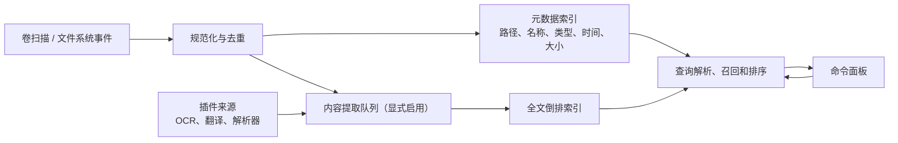

# 本地搜索引擎分期设计

## 目标与边界

iHub 的本地搜索不是把文件路径交给一个慢速数据库过滤，而是一个面向桌面工作流的索引服务：在用户唤起面板后快速返回文件、目录、应用、最近项目和可选的文件内容命中。第一目标是替代日常 Everything 式的文件名/路径检索，第二目标才是内容、OCR 和插件来源。

首发只承诺 Windows 与 macOS。当前实现默认扫描用户的 Desktop、Documents、Downloads、Pictures、Music、Videos（可用 `IHUB_INDEX_ROOTS` 覆盖）；也可在“工具 → 本地搜索”维护绝对目录，保存后立即重新扫描，清空并保存会恢复默认目录。已保存的自定义目录若在下次启动时不可用，iHub 会停止该范围并提示用户修复，绝不悄悄回退到默认目录。系统目录、网络盘、云端按需文件、加密卷和大体积内容索引都必须是显式选择，不能为了“全盘搜索”悄悄扫描或上传用户数据。

| 指标 | P0/P1 目标 | 说明 |
| --- | --- | --- |
| 热查询首批结果 | < 30 ms | 常见文件名/路径查询，索引已打开、50k 条以内 |
| 冷启动可搜索 | < 500 ms | 打开已有元数据索引，不等待全盘重扫 |
| 增量事件延迟 | < 2 s | 本地变更进入候选集；繁忙卷可合并批处理 |
| 内存预算 | < 250 MB | 100 万路径的默认元数据索引，内容索引另计 |
| 结果稳定性 | 同一快照排序确定 | 防止输入一字符时结果随机跳动 |

## 分层架构



核心进程维持三个可独立恢复的层：

1. **目录与事件层**：扫描器只输出统一 `FileRecord` 事件（创建、修改、移动、删除、溢出）。Windows 的 NTFS USN P1a 会只读验证已授权盘符卷的卷序列号、Journal ID 与水位，并持久化这份无路径的 checkpoint。P1c 已增加 `FSCTL_ENUM_USN_DATA` 的只读 MFT 初始化，且仅在用户明确授权盘符根目录（如 `C:\`）时读取该卷的文件名元数据；`C:\Users\me` 这类窄目录绝不会因此扩大为全卷读取，仍走受限目录扫描。MFT 文件/父文件 ID 和原始 USN 记录只在内存重建路径后丢弃，绝不写入 checkpoint；P1c 仅在同一次初始化前后通过只读 `FSCTL_READ_USN_JOURNAL` 收敛一个有界窗口。P1d 只在 iHub 状态目录不属于任何授权盘符根目录时，把完整 P1c 快照与其扫描前的元数据基线放在同一个原子快照内；下次启动在 watcher 已完整登记根目录后，只在所有授权盘符根目录的 Journal 身份、有效范围和 `NextUsn` 完全未变时复用快照。无法使用时始终退回 `ReadDirectoryChangesW` + 已授权目录扫描；macOS 使用 FSEvents，事件 ID 持久化并在历史丢失时仅重扫受影响根目录。
   P1e 在 Journal 已前进时从同一原子快照中的 cutoff 回放有限、可精确表达的变更；回放后的稳定路径与搜索条目逐条重建并在多卷截止点、快照落盘前双重验证。任何未知拓扑、硬链接变更、重解析点、Journal 间断或并发变化都不猜测，直接退回授权范围扫描。
   P1e 的例外是 v3 原子快照中有界的 stable-path 身份绑定；它保存已索引路径所需的 FRN/父 FRN 与根身份，但不保存原始 USN 记录，也不写入独立的 P1a metadata-only checkpoint。
2. **元数据层**：路径、标准化名称、卷 ID、稳定文件 ID、父目录、时间、大小、MIME/扩展名和可见性策略使用事务型存储。路径是可重建投影，稳定文件 ID 才是去重、重命名与内容缓存的主键。
3. **检索层**：文件名/路径走内存前缀表、n-gram/fuzzy 候选与轻量倒排；正文走独立全文倒排（Rust 可选 Tantivy）。查询服务把两类召回合并，不让全文索引阻塞普通文件名搜索。

SQLite 适合元数据、设置、扫描水位与事务恢复；全文索引应采用可分段、可合并的倒排实现。二者之间只通过稳定 ID 关联，任何一侧损坏都能在不丢失另一侧的情况下重建。

## 分期

### P0：可用的路径搜索（MVP）

- 当前实现以有限并发扫描默认用户内容目录，也支持在本地工具箱保存最多 32 个已规范化的绝对目录（`IHUB_INDEX_ROOTS` 仍可作为未配置时的启动覆盖）。切换目录会立即清除旧范围的文件/目录缓存；后台扫描只在同一授权范围内保留旧完整快照。**路径扫描**不读取/上传文件内容，也不会跟随链接；受限正文读取由下方单独的内存 worker 负责。当前不会读取 `.gitignore`，因此显式配置代码目录时会扫描其可见文件。
- 应用作为独立、只读来源先行发布：Windows 仅扫描用户与公共 Start Menu Programs 的可启动快捷方式；macOS 仅扫描系统／用户的 Applications 与 PreferencePanes 根目录中的 `.app`、`.prefPane`。扫描有数量、目录和深度上限，结果只有在用户显式选择后才由系统打开。
- 建立名称、完整路径、扩展名、目录标记、修改时间和大小索引；当前提供大小写宽松的文件名/路径模糊匹配。内存搜索投影会把名称和含非 ASCII 的路径折叠为 Unicode NFKC；全宽字符、兼容连字以及组合／分解形式不同的文件名可互相命中。中文名称和路径由一份进程级词典直接匹配无声调全拼、拼音首字母、中文／英文混输与未完成音节，因此 `zhongwenjihua`、`zwjh` 都能找到“中文计划”。多音字的所有词典读音都可召回，但当前不进行词组上下文消歧。显示路径和持久化快照仍保留原始拼写，索引不会为每条记录保存拼音字符串。
- 查询语法包含普通模糊词、`path:`、`ext:`、`kind:file|folder`、`modified:today|7d`、`size:>100mb`，以及只在用户明确写出时才使用的 `content:` / `body:` 正文词组。
- 原生索引的文本排序优先级为：原文精确名称 > 原文名称前缀 > 原文模糊名称／路径 > 全拼名称 > 拼音首字母名称 > 路径拼音。固定项只决定启动页分组与可启动入口，不是搜索分数加成。对含 ASCII 字母/数字的普通模糊词，当前索引会在同一个内存快照中保存名称和路径各自的 36-bit 字符签名；构建签名时会把每个汉字的所有词典读音字母 OR 进去，首字母复用全拼字母集合。仅当一个词在名称或路径中都不可能包含其全部 ASCII 字符时才跳过后续匹配。它忽略顺序、重复、符号与 Unicode，因此只是安全的必要条件预筛选：允许假阳性，不允许假阴性；过长的合成路径会把签名置为“全部可能”而不是隐藏结果。条目、签名与 NFKC 折叠由同一读写锁原子发布，内部长度不一致则保守走完整评分。拼音匹配器按查询词构建一次并在线程间共享，所有条目共享一份词典；持久化模型不含拼音派生数据。
- 启动器在动作成功打开或交付后才更新本地自适应排序。账本最多 256 项、保留 180 天，以 14 天半衰期衰减频率／时效；“最近使用”按该权重排列，搜索合并层为同一结果加入最高 480 分。这个 usage boost 本身小于 exact 与 prefix 的 1,000 分文本层级差，因此不能单独把较弱的 prefix 结果抬过 exact 结果。账本把原始结果 ID 映射为两个 64-bit 摘要组成的 `usage-v1` 伪匿名键，只保存键、计数与时间戳，不保存路径、查询文本、剪贴板内容或插件 payload；180 天外记录和超出容量的低权重记录会被丢弃。
- 首次成功扫描会原子写入版本化 JSON 快照；下次启动先载入上次快照，并在后台验证范围时继续提供旧结果。界面展示索引范围、最后索引同步时间和文件监听健康状态。当前会用跨平台系统监听器仅监听已授权根目录：Windows 由底层推荐实现选择 `ReadDirectoryChangesW`，macOS 选择 FSEvents/kqueue；事件按路径再次校验范围、约 650ms 去抖，连续写入最多 5 秒合并为一批。普通文件创建、修改、移动、删除会在内存索引中以路径增量替换；目录事件只重走该目录子树。已排序的旧索引与已排序的替换集合会线性归并，避免 Windows 小文件通知把整个索引重新排序。普通正向模糊查询会在解析阶段规范化词项，并把候选名称的大小写折叠延后到模糊命中之后，避免每次输入都为所有未命中文件分配副本。更新后的内存索引会以约 2 秒去抖、最长 12 秒合并的方式另行写入快照，避免每个事件批次同步序列化完整索引；写入失败会在后台退避重试。监听队列溢出、无路径重扫提示、根目录边界变化、未预期 I/O 错误或过大的事件批次才会安全重扫当前授权根目录；切换目录会先撤销旧监听并清空旧事件批次。
- Windows 已补上 P1a 的只读卷级基础：对已授权的**本地盘符 NTFS 卷**查询 `GetVolumeInformationW` 与 `FSCTL_QUERY_USN_JOURNAL`，并在应用数据目录持久化 schema-checked 的卷序列号、Journal ID、`NextUsn`、`LowestValidUsn` 和观察时间。挂载卷、UNC、非 NTFS、权限不足、Journal 未启用、损坏 checkpoint 或水位不连续都会明确标记并继续采用当前目录扫描/文件监听；P1a 不创建 Journal、不保存路径/文件 ID/USN 记录。
- Windows P1c 现有一个严格受限的初始路径加速：只有索引范围中**显式包含某个直接盘符根目录**（例如 `C:\`）时，才会在只读句柄上调用 `FSCTL_ENUM_USN_DATA` 并从 NTFS V2 USN/MFT 记录重建该根下的路径。初始化前会记录活跃 Journal 的 `NextUsn`，投影后重新查询同一卷；只有卷序列号、Journal ID 与有效水位连续时，才以只读 `FSCTL_READ_USN_JOURNAL` 在固定调用、缓冲、记录和临时内存上限内回放至第二个水位。仅可无歧义投影的创建、删除、重命名会更新这个进程内 MFT 映射；硬链接、重解析点、未知/新记录版本、格式异常、游标缺口、Journal 截断、超限、权限错误、卷/根目录变化或任何未完整覆盖的卷都会丢弃那一卷的 MFT 结果，继续使用已授权的目录扫描。MFT 文件 ID、父 ID、原始记录和文件正文均不会持久化；普通路径快照仍只保存已有模型允许的路径元数据。窄目录、UNC、挂载卷和其他平台不会读取整卷 MFT。
- Windows P1d/P1e 提供严格受限的跨重启快启：完整 P1c 枚举成功、watcher 完整登记、且 iHub 状态目录位于所有授权盘符根目录之外时，v3 原子快照会同时保存路径条目和每卷有界 stable-path 绑定（已索引路径、FRN、父 FRN、名称、目录标记、盘符根 FRN 与 MFT 初始化后截止水位）。下一次启动先登记目录 watcher；Journal 完全未前进时直接复用，发生变化时才以只读 `FSCTL_READ_USN_JOURNAL` 从保存水位回放到新的静默截止点。回放只接受可精确表达的创建、删除、成对重命名、目录子树重命名和元数据变更；硬链接变更、重解析点、未知 FRN/父链、未配对重命名、格式/水位异常、Journal 截断、卷或根身份变化、权限错误、超限或任何范围不确定都会立即回退完整扫描。成功回放后仅重新读取受影响路径，并在多卷回放完成后及原子写入前各复核一次所有授权卷的 Journal。运行期 watcher 的普通增量快照会有意丢弃 P1e 绑定，下一次启动保守重扫；iHub 状态目录也会从用户索引和路径事件批次中排除，避免自触发循环。P1d/P1e 均不创建、删除或修改 USN Journal。

当前 P0 已覆盖快照加载/安全替换、结构化筛选，以及监听事件范围过滤与去抖逻辑的单元测试。10 万条性能基准、真实目录变更一致性、断电恢复和事件溢出压测仍是发布门槛，不能以普通递归扫描替代。

#### 本地合成性能验收（手动）

为让路径搜索的性能目标可重复测量，仓库提供了一个**被忽略的、纯内存**基准测试。它只生成确定性的文件元数据，复用当前索引的排序、去重、500,000 条生产上限和 `search()`；不会枚举默认/已配置目录、读取真实文件、启动 iHub、创建 watcher 或写入快照。Cargo 在首次运行时可能更新其正常的构建/依赖缓存，但不会写入 iHub 的索引根或用户内容目录。

Windows：

```powershell
.\scripts\run-search-benchmark.ps1
# 可选：更大输入与更多样本
.\scripts\run-search-benchmark.ps1 -Entries 500000 -Samples 31
```

macOS：

```bash
bash ./scripts/run-search-benchmark.sh
# 可选：更大输入与更多样本
bash ./scripts/run-search-benchmark.sh --entries 500000 --samples 31
```

`Entries` 仅允许 `100000`、`500000` 或 `1000000`，`Samples` 必须是 5–101 之间的奇数。输出会明确列出 `input_entries`、`indexed_entries`、`cold_build_ms`、Rayon 线程数，以及普通精确文件名、可区分的精确文件名、全拼、拼音首字母、多词文件名和结构化筛选查询的 `p50_ms` / `p95_ms`。每行还会显示候选签名实际保留的 `candidates/indexed_entries` 与 `ascii_prefilter`；这是辅助诊断，不是结果数或正确性承诺。百分位使用 nearest-rank；先进行三次预热，因此查询时间描述的是交互式稳态，`cold_build_ms` 描述合成、排序、去重、限额和内存快照发布（含候选签名、按需 NFKC 与共享拼音词典签名）的组合时间，**不是**真实磁盘扫描或 Everything 数据库建库时间。

1,000,000 输入模式是压力检查，不表示产品已经支持一百万常驻条目：当前 `MAX_INDEXED_ENTRIES` 为 500,000，输出会显示输入如何被同一生产上限裁剪后再查询。测试还会验证容量上限、精确命中、非空结果和请求的结果数上限；它故意不写硬件相关的毫秒断言，避免把 CI 的机器抖动误判为功能回归。

在选定的基线硬件和 release profile 上，建议先以 100,000 输入设定以下人工验收预算，再决定是否把趋势采集接入 CI：冷构建不超过 2 秒；精确文件名 P95 不超过 150 ms；多词文件名 P95 不超过 300 ms；结构化筛选 P95 不超过 80 ms。比较必须使用相同 OS、Rust 版本、线程数和电源模式；超标时记录输出并分析，不要以这条合成测试代替真实目录变更、一百万持久化索引或 macOS FSEvents 验收。

### P1c/P1e：持续索引与 Everything 级路径体验

- 已实现初始 MFT 枚举的严格子集：在 P1a 已验证的 NTFS checkpoint 之上，Windows 对显式授权的盘符根目录使用只读 `FSCTL_ENUM_USN_DATA` 构建路径投影；随后仅对这次初始化前后之间的连续 Journal 区间使用只读 `FSCTL_READ_USN_JOURNAL` 修正创建、删除和重命名。`ReadDirectoryChangesW` 和已授权目录扫描仍是所有窄目录、失败和持续更新路径的回退。没有全局扫描开关，也不会因为一个子目录授权而读取其余卷的文件名。
- 已实现严格的 P1d/P1e 快启：只对 P1c 完整覆盖、watcher 已完整登记且 iHub 状态目录不在授权卷内的直接盘符根目录，将 entries 与 stable-path 绑定写入同一个 v3 原子文件。重启时先验证零变更；存在 Journal 增量时，逐卷只读回放保存 cutoff 到新的安静 cutoff，并且只重新读取受影响的稳定路径。绑定与恢复条目必须逐条精确匹配路径原始拼写、名称和文件/目录类型，回放的每个卷以及最终所有卷都会复核 Journal；任何未知事件、间断、竞争写入或快照写入失败都放弃这次快启。普通 watcher 的运行期增量快照不延续该绑定，因此后续重启保守全扫。
- 已实现 P1e-a 的跨重启 `FSCTL_READ_USN_JOURNAL` 增量回放，但它仍是有条件的安全加速而非完整 Everything 数据库：只支持明确授权的直接 NTFS 盘符根目录、外置状态目录、完整 MFT 绑定和有限变更；macOS、窄目录、UNC、挂载卷以及回放失败都会走现有扫描/监听回退。后续仍需长期压力测试、持久化 live binding、SQLite/Tantivy 以及 macOS 变更水位恢复。
- 建立“事件水位 + 周期性抽样校验”机制。发现 journal/FSEvents 溢出、卷 ID 改变或权限失败时，标记范围为 stale 并局部重扫，而不是假装结果正确。
- 支持应用、别名、快捷方式和最近打开记录作为独立来源；来源分数和文件结果可以并列展示。
- 查询支持引号短语、`-` 排除、`in:` 根目录、`type:app`，并提供可见的解析 token，避免隐藏语法导致误解。
- 搜索 RPC 采用流式批次：先在 30 ms 内返回高置信候选，随后增量补充；每个响应携带索引代次，前端丢弃过期响应。

P1 的验收是：100 万元数据记录在预算内常驻；1000 次随机重命名/删除/移动后与真实文件树抽样一致；停机重启无需全盘扫描。

### 已实现：受限的本地正文索引（P2 的安全起点）

- 路径扫描完成后会另起低优先级后台任务，为当前**已授权根目录**中的小型文本、Markdown、配置和常见源码文件建立内存正文投影；普通文件名/路径搜索先可用，不会等待正文读取。
- 单源文件最大 1 MiB、每个文件只读前 48 KiB、最多 8,000 个文件、进程内总预算 48 MiB。只接受 UTF-8 或带 BOM 的 UTF-16；含 NUL 的二进制候选会被拒绝。支持的扩展名是显式白名单，当前不解析 Office、PDF、媒体或图片。
- 使用 `content:关键词`、`content:"短语"` 或 `body:` 才会查正文；普通查询绝不会被悄悄扩展成全文检索。命中会显示一个受 180 字符限制的本地预览。
- 文件正文带 `serde(skip)`，不会写入 JSON 路径快照或上传；范围切换会立即从内存清除，路径事件会触发新的受限重建。状态面板会分别展示路径索引与正文索引的健康状态。

这不是完整 P2：还没有每根目录/类型的正文开关、持久化倒排、哈希去重、Office/PDF/OCR 解析、节流队列、稳定文件 ID 或内容索引迁移。损坏、超限、二进制和无法解码的文件会被跳过，不能让它们阻断路径索引。

### P2：可扩展的受控内容索引

- 增加按根目录、文件类型和最大文件大小逐项授权，以及可暂停/限速的解析队列。
- 为可选 Office/PDF/OCR 提取器提供纯文本、语言、页/段落定位、内容哈希和严格资源上限；密钥、凭据、媒体和用户排除规则始终不进入正文索引。
- 采用可恢复的全文倒排与稳定 ID 关联；删除文件会删除对应全文段，索引升级可以重建和回滚。

完整 P2 的验收是：损坏文档、无限大文本和解析器崩溃不会导致主进程退出；删除文件会删除对应全文段；内容绝不离开本机。

### P3：插件化增强与高级召回

- `ihub-plugin-ocr` 把图片/PDF OCR 作为可选提取器，产出文字及页/框定位；结果必须标记 OCR 置信度。
- `ihub-plugin-translate` 只在用户动作或明确设置后处理结果，不把完整本地索引偷偷发送到云端。
- 可增加 PDF/Office、Git 仓库、浏览器书签、剪贴板历史、开发者文档和媒体元数据插件。插件提供候选、提取器或动作，不直接写核心索引数据库。
- 前端插件使用 TypeScript SDK，后端可为受用户信任的二进制。因为二进制插件不采用沙箱，安装页必须展示仓库、版本、哈希、权限、网络行为和可执行文件清单；GitHub 导入默认固定 commit/tag。当前更新流程会在暂存前比对候选版本的权限与二进制声明，声明变化会被阻断并要求用户重新审阅／导入；尚未提供逐字段权限或哈希 diff 界面。
- 核心用版本化 RPC 和 `SearchProvider` / `ContentExtractor` 协议交互，给每次调用 deadline、取消 token、并发配额和崩溃隔离。不能因为“无沙箱”就允许插件阻塞索引服务。

## 查询与排序细节

启动器合并层的可审计顺序是 `文本相关性 + 来源权重 + 原生结果分数 + 本地 usage boost`，计算器与时间表达式有各自的显式高置信入口。文本层为 exact 4,000、name prefix 3,000、name contains 2,000、path prefix 1,200、path contains 900、metadata contains 650；来源权重与原生分数随后加入，usage boost 固定封顶 480，只用于重新排列相关性接近的候选。固定状态不是分数项；“隐藏最近使用”只控制首页分组显示，不被描述为关闭这份自适应排序账本。

规范化要同时保留显示路径和检索键：Unicode NFKC、大小写折叠、路径分隔符、中文/拼音匹配信号和扩展名分别处理。不要覆盖原始显示路径，否则会在 macOS 大小写卷、中文混输和重命名场景失去正确性。

查询解析器只生成结构化 AST，不拼接 SQL 或把原始文本交给插件。未知字段应退回普通文本并显示提示；解析失败必须有可预测的降级行为。

## 数据安全、恢复与可观测性

- 所有索引和日志默认保存在应用数据目录，权限继承当前用户；内容索引单独可删除、可导出范围、可完全关闭。
- 记录匿名性能指标（扫描耗时、队列长度、命中延迟）需 opt-in，绝不记录路径、查询文本或正文。
- 索引 schema 与全文分段都带版本。升级先创建新代次，完成后原子切换；失败回滚到旧代次，不能删除唯一可用索引。
- 提供诊断页：索引根、权限错误、事件溢出、最后一致时间、队列状态和重建按钮。诊断导出需先脱敏路径。

## 测试矩阵与发布门槛

测试树应包含中文/emoji/超长路径、大小写差异、符号链接、权限拒绝、网络盘、移动硬盘、USN/FSEvents 溢出、百万级空文件、不断写入的大文件和损坏文档。每个发布候选至少运行：正确性抽样、性能基准、断电/进程杀死恢复、索引迁移回滚、插件崩溃隔离和隐私规则回归。

只有在 P1 的路径索引稳定后才进入内容索引；只有在 P2 的资源、权限和恢复策略经过压测后才开放 OCR/二进制提取插件。这个顺序能把“快速找到文件”的核心体验从高风险解析与不受沙箱约束的插件执行中隔离出来。
