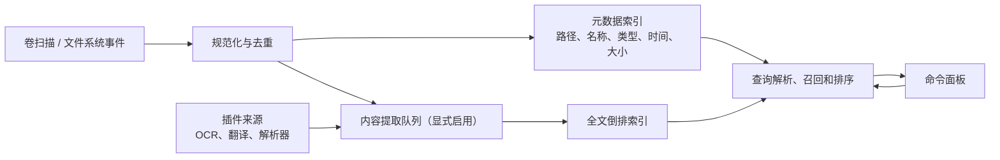

# 本地搜索引擎分期设计

## 目标与边界

iHub 的本地搜索不是把文件路径交给一个慢速数据库过滤，而是一个面向桌面工作流的索引服务：在用户唤起面板后快速返回文件、目录、应用、最近项目和可选的文件内容命中。第一目标是替代日常 Everything 式的文件名/路径检索，第二目标才是内容、OCR 和插件来源。

首发只承诺 Windows 与 macOS，默认索引用户明确选择的目录。系统目录、隐藏目录、网络盘、云端按需文件、加密卷和大体积内容索引都必须是显式选择，不能为了“全盘搜索”悄悄扫描或上传用户数据。

| 指标 | P0/P1 目标 | 说明 |
| --- | --- | --- |
| 热查询首批结果 | < 30 ms | 常见文件名/路径查询，索引已打开、50k 条以内 |
| 冷启动可搜索 | < 500 ms | 打开已有元数据索引，不等待全盘重扫 |
| 增量事件延迟 | < 2 s | 本地变更进入候选集；繁忙卷可合并批处理 |
| 内存预算 | < 250 MB | 100 万路径的默认元数据索引，内容索引另计 |
| 结果稳定性 | 同一快照排序确定 | 防止输入一字符时结果随机跳动 |

## 分层架构

核心进程维持三个可独立恢复的层：

1. **目录与事件层**：扫描器只输出统一 `FileRecord` 事件（创建、修改、移动、删除、溢出）。Windows 优先使用 NTFS USN Journal 实现快速初始化和断点恢复，无法使用时退回 `ReadDirectoryChangesW` + 分片扫描；macOS 使用 FSEvents，事件 ID 持久化并在历史丢失时仅重扫受影响根目录。
2. **元数据层**：路径、标准化名称、卷 ID、稳定文件 ID、父目录、时间、大小、MIME/扩展名和可见性策略使用事务型存储。路径是可重建投影，稳定文件 ID 才是去重、重命名与内容缓存的主键。
3. **检索层**：文件名/路径走内存前缀表、n-gram/fuzzy 候选与轻量倒排；正文走独立全文倒排（Rust 可选 Tantivy）。查询服务把两类召回合并，不让全文索引阻塞普通文件名搜索。

SQLite 适合元数据、设置、扫描水位与事务恢复；全文索引应采用可分段、可合并的倒排实现。二者之间只通过稳定 ID 关联，任何一侧损坏都能在不丢失另一侧的情况下重建。

## 分期

### P0：可用的路径搜索（MVP）

- 用户选择索引根目录；后台以有限并发扫描，忽略规则复用 `.gitignore` 风格语义但不读取或上传内容。
- 建立名称、完整路径、扩展名、目录标记、修改时间和大小索引；支持拼音/大小写/Unicode 规范化后的宽松匹配。
- 查询语法仅包含普通模糊词、`path:`、`ext:`、`kind:file|folder`、`modified:today|7d` 与 `size:>100mb`。
- 排序优先级：精确名称 > 名称前缀 > 词序一致 > 路径匹配；再结合最近打开、用户固定和较浅目录的小幅加分。所有加分都要可解释。
- 界面展示索引范围、最后扫描时间和“结果可能过期”状态；扫描、删除和重建有取消按钮。

P0 的验收是：10 万条测试路径下持续输入无主线程卡顿；目录重命名不会遗留重复项；断电后能从上一个一致快照恢复。

### P1：持续索引与 Everything 级路径体验

- 接入 Windows USN Journal、`ReadDirectoryChangesW` 回退与 macOS FSEvents；事件按卷/根目录有序合并，同一文件的短时多次变化去抖。
- 建立“事件水位 + 周期性抽样校验”机制。发现 journal/FSEvents 溢出、卷 ID 改变或权限失败时，标记范围为 stale 并局部重扫，而不是假装结果正确。
- 支持应用、别名、快捷方式和最近打开记录作为独立来源；来源分数和文件结果可以并列展示。
- 查询支持引号短语、`-` 排除、`in:` 根目录、`type:app`，并提供可见的解析 token，避免隐藏语法导致误解。
- 搜索 RPC 采用流式批次：先在 30 ms 内返回高置信候选，随后增量补充；每个响应携带索引代次，前端丢弃过期响应。

P1 的验收是：100 万元数据记录在预算内常驻；1000 次随机重命名/删除/移动后与真实文件树抽样一致；停机重启无需全盘扫描。

### P2：受控内容索引

- 内容索引默认关闭，按根目录、文件类型和最大文件大小逐项授权。文本、Markdown、源代码、Office/PDF 解析器都有时间、内存和输出大小上限。
- 提取器输出纯文本、语言、页/段落定位与哈希；相同内容哈希去重。二进制、媒体、密钥、凭据文件和用户排除规则一律不进入正文索引。
- 使用队列隔离低优先级提取：交互搜索、文件系统事件和电源/电池状态可以暂停或限速队列。
- 查询支持 `content:` 或正文模式开关，并将命中片段、来源文件、解析时间明确标示。默认不会把全文结果混入纯路径结果，除非用户选择。

P2 的验收是：损坏文档、无限大文本和解析器崩溃不会导致主进程退出；删除文件会删除对应全文段；内容绝不离开本机。

### P3：插件化增强与高级召回

- `ihub-plugin-ocr` 把图片/PDF OCR 作为可选提取器，产出文字及页/框定位；结果必须标记 OCR 置信度。
- `ihub-plugin-translate` 只在用户动作或明确设置后处理结果，不把完整本地索引偷偷发送到云端。
- 可增加 PDF/Office、Git 仓库、浏览器书签、剪贴板历史、开发者文档和媒体元数据插件。插件提供候选、提取器或动作，不直接写核心索引数据库。
- 前端插件使用 TypeScript SDK，后端可为受用户信任的二进制。因为二进制插件不采用沙箱，安装页必须展示仓库、版本、哈希、权限、网络行为和可执行文件清单；GitHub 导入默认固定 commit/tag，并支持更新前 diff。
- 核心用版本化 RPC 和 `SearchProvider` / `ContentExtractor` 协议交互，给每次调用 deadline、取消 token、并发配额和崩溃隔离。不能因为“无沙箱”就允许插件阻塞索引服务。

## 查询与排序细节

每个候选都生成可审计的分数：`文本相关性 + 路径质量 + 来源权重 + 最近使用 + 用户固定 - 排除/陈旧惩罚`。文件系统索引绝不能把“最近打开”提升到精确名称命中之前；用户可以关闭历史与行为加分。

规范化要同时保留显示路径和检索键：Unicode NFC、大小写折叠、路径分隔符、中文/拼音 token 和扩展名分别存储。不要只用一个小写字符串，否则会在 macOS 大小写卷、中文混输和重命名场景失去正确性。

查询解析器只生成结构化 AST，不拼接 SQL 或把原始文本交给插件。未知字段应退回普通文本并显示提示；解析失败必须有可预测的降级行为。

## 数据安全、恢复与可观测性

- 所有索引和日志默认保存在应用数据目录，权限继承当前用户；内容索引单独可删除、可导出范围、可完全关闭。
- 记录匿名性能指标（扫描耗时、队列长度、命中延迟）需 opt-in，绝不记录路径、查询文本或正文。
- 索引 schema 与全文分段都带版本。升级先创建新代次，完成后原子切换；失败回滚到旧代次，不能删除唯一可用索引。
- 提供诊断页：索引根、权限错误、事件溢出、最后一致时间、队列状态和重建按钮。诊断导出需先脱敏路径。

## 测试矩阵与发布门槛

测试树应包含中文/emoji/超长路径、大小写差异、符号链接、权限拒绝、网络盘、移动硬盘、USN/FSEvents 溢出、百万级空文件、不断写入的大文件和损坏文档。每个发布候选至少运行：正确性抽样、性能基准、断电/进程杀死恢复、索引迁移回滚、插件崩溃隔离和隐私规则回归。

只有在 P1 的路径索引稳定后才进入内容索引；只有在 P2 的资源、权限和恢复策略经过压测后才开放 OCR/二进制提取插件。这个顺序能把“快速找到文件”的核心体验从高风险解析与不受沙箱约束的插件执行中隔离出来。
